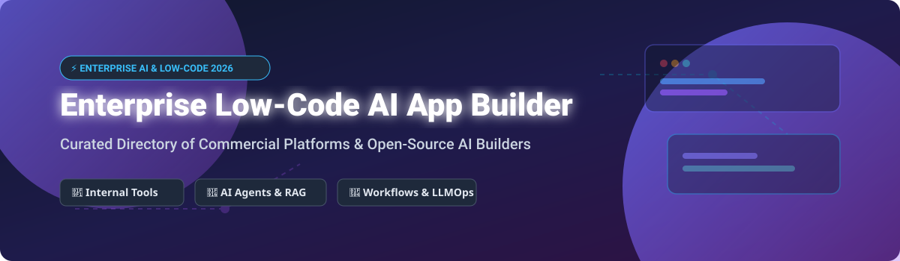

# Awesome-Enterprise-Low-Code-AI-App-Builder 🧱 🤖 🚀

  

  
  
  
  
  

---

## 🌟 Enterprise Low-Code AI App Builder Ecosystem ⚡

**Curated Directory of Commercial Low-Code Platforms & Open-Source AI App Builders** 🛠️  

*Focusing on Visual App Development, AI Agent Orchestration, LLMOps Workflows, Internal Tool Builders, RAG Pipelines & Rapid Enterprise Software Engineering*

**Last updated: October 2026** 📅

---

### 📌 Overview & SEO Summary 🔍

Welcome to the ultimate community-curated directory for **enterprise low-code AI app builders**, **open-source internal tool development frameworks**, **LLM orchestration platforms**, and **visual workflow automation engines**. 

Whether you are evaluating enterprise-grade commercial platforms (*Microsoft Power Apps*, *AWS App Studio*, *Retool*, *OutSystems*, *Mendix*) or looking for privacy-focused, self-hostable open-source frameworks (*n8n*, *Dify*, *Appsmith*, *ToolJet*, *Flowise*, *Budibase*), this directory provides structured metrics, licensing models, exact pricing tiers, and GitHub popularity tracking to guide your software architecture decisions. 🚀

#### 💡 Key Market Context & Trends:
- **Enterprise Adoption:** Over 70% of new enterprise applications leverage low-code or generative AI visual builders to accelerate internal tooling and operational automation. 🏢
- **Open-Source Dominance:** Developers heavily favor self-hosted low-code tools like **n8n** (50K+ stars), **Dify** (45K+ stars), and **Appsmith** (35K+ stars) for full data sovereignty, custom database connectors, and zero lock-in LLM integrations. 🔓
- **Agentic AI & RAG Integration:** Modern low-code platforms are transitioning from simple CRUD UI builders into **LLMOps and AI Agent visual builders** enabling drag-and-drop RAG (Retrieval-Augmented Generation) pipelines and multi-agent coordination. 🤖

---

## 📑 Table of Contents 📖

- [🏢 SaaS & Commercial Platforms](#-saas--commercial-platforms)
- [🔓 Open-Source GitHub Projects](#-open-source-github-projects)
- [🛠️ How to Contribute](#%EF%B8%8F-how-to-contribute)
- [📊 Star History](#-star-history)
- [🤝 Support & Sponsorship](#-support--sponsorship)
- [⚠️ Disclaimer](#%EF%B8%8F-disclaimer)

---

## 🏢 SaaS & Commercial Platforms 💼

### 📈 Market Size & Sector Dynamics
> 📊 **Estimated Market Size:** The global enterprise low-code and AI application development platform market is valued at approximately **$32.5 Billion in 2026** and is projected to reach **$65+ Billion by 2030** (CAGR ~22.5%).  
> 🏆 **Market Structure:** The sector is **moderately fragmented**, featuring giant tech incumbents (Microsoft, Amazon, Siemens/Mendix) dominating traditional enterprise application suites, while specialized hyper-growth platforms (Retool, Dify, Bubble) capture high-growth niches in rapid internal tools and AI-native web apps.

*Platforms below are sorted by **Company Size / Valuation / Market Cap (Descending)**:* 📉

| SaaS / Commercial Platform 🚀 | Company / Owner 🏢 | Company Size (Valuation / Market Cap) 💰 | Standard Edition Starting Price 💵 | Free Tier / Free Trial Limits 🎁 | Description 📝 |
| :--- | :--- | :--- | :--- | :--- | :--- |
| **[Microsoft Power Apps](https://powerapps.microsoft.com/)** 🔷 | Microsoft | **~$3.90 Trillion** | **$20/user/month** (Premium) | **Free Developer Plan (2GB Dataverse, 750 flow runs/mo)** | **Microsoft-native low-code platform** — Canvas and model-driven apps. Copilot for app generation with deep Microsoft 365 & Azure integration. ⚡ |
| **[AWS App Studio](https://aws.amazon.com/appstudio/)** ☁️ | Amazon | **~$2.00 Trillion** | **$0.25/user-hour** (Published apps) | **Free building & testing environment** | **AWS-native low-code platform** — Generative AI-powered app development. Describe apps in natural language with enterprise IAM & SSO. 🛡️ |
| **[Mendix](https://www.mendix.com/)** 🏢 | Mendix (Siemens) | **~$1.40 Billion** | **$1,875/month** (Basic) | **Free: 1 developer, 1 app environment** | **Enterprise low-code platform** — Full-stack application development with governance, Mendix Assist AI, and multi-cloud deployment options. 🌐 |
| **[OutSystems](https://www.outsystems.com/)** 🚀 | OutSystems | **~$9.50 Billion** | **$36,300/year** (Developer Cloud) | **Free Personal Edition (1 env, 2GB DB, 100 users)** | **High-performance enterprise platform** — Full-stack dev with OutSystems AI Agent for enterprise-scale software generation. 🧱 |
| **[Retool](https://retool.com/)** 🛠️ | Retool | **~$3.20 Billion** | **$10/user/month** (Standard) | **Free: 5 users, 500 workflow runs/month** | **Internal tool builder** — Drag-and-drop UI with 100+ components, database/API integrations, and Retool AI app generation. 🎯 |
| **[Bubble](https://bubble.io/)** 🫧 | Bubble | **~$500 Million** | **$29/month** (Starter) | **Free: 1 app editor, 100 workflow runs/month** | **No-code web app builder** — Full-stack visual web development without code, featuring AI-powered app generation with Bubble AI. 🎨 |
| **[ToolJet](https://www.tooljet.com/)** 🧰 | ToolJet | **Private ($20M+ raised)** | **$79/builder/month** (Team) | **Free Cloud (2 builders, 50 users, 100 AI credits)** | **Open-source low-code platform** — AI-powered app generation, 60+ data connectors, self-hosted or cloud with enterprise RBAC. 🔒 |
| **[Dify](https://dify.ai/)** 🎨 | Dify | **Private ($15M+ raised)** | **$59/month** (Professional) | **Free: 200 message credits, 10 vector builds** | **LLMOps platform with agentic workflows** — Visual workflow builder, RAG pipelines, LLM nodes, and self-host/cloud support. 🤖 |
| **[Flowise](https://flowiseai.com/)** 🎯 | FlowiseAI | **Private ($5M+ raised)** | **$35/month** (Starter) | **Free Cloud: 2 chatflows, 100 predictions/month** | **Drag-and-drop LLM app builder** — Visual editor for chatbots, agents, and multi-agent workflows. Model-agnostic and free to self-host. 🔄 |
| **[Appsmith](https://www.appsmith.com/)** 📦 | Appsmith | **Private ($28M+ raised)** | **$15/user/month** (Business) | **Free: 5 users, unlimited apps** | **Open-source internal tool builder** — 45+ UI widgets, database/API connectors, self-hosted Docker/K8s deployment, and Appsmith AI. 🧪 |

---

## 🔓 Open-Source GitHub Projects 🌐

*Open-source low-code AI app builders and workflow engines, sorted by **GitHub Stars Count (Descending)**:* 🌟

- **[n8n](https://github.n8n.io/n8n/n8n)**  🔄  
  **Workflow automation with native AI capabilities**, Sustainable Use License. **50K+ GitHub stars** — Visual workflow builder with 400+ integrations, native LangChain nodes, LLM orchestration, and self-hosted privacy control. 🤖

- **[Dify](https://github.com/langgenius/dify)**  🎨  
  **LLMOps platform with agentic workflows**, Apache-2.0 licensed. **45K+ GitHub stars** — Visual LLM workflow builder combining prompt engineering, RAG pipelines, agent nodes, and model management. 🧪

- **[Appsmith](https://github.com/appsmithorg/appsmith)**  🛠️  
  **The leading open-source low-code platform for internal tools**, Apache-2.0 licensed. **35K+ GitHub stars** — Build admin panels, dashboards, and CRUD apps with 45+ UI widgets and direct SQL/REST connectors. 📦

- **[ToolJet](https://github.com/ToolJet/ToolJet)**  🧰  
  **Open-source low-code internal tool framework**, AGPL-3.0 licensed. **30K+ GitHub stars** — Natural language AI app generator, 60+ data connectors, customizable JS widgets, and enterprise RBAC. 🔐

- **[Flowise](https://github.com/FlowiseAI/Flowise)**  🎯  
  **Drag-and-drop LLM app builder**, Apache-2.0 licensed. **28K+ GitHub stars** — UI node-based builder for LangChain and LlamaIndex agents, memory components, and vector store connectors. 💡

- **[Budibase](https://github.com/Budibase/budibase)**  🏗️  
  **Open-source low-code platform for internal apps**, GPL-3.0 licensed. **22K+ GitHub stars** — Rapid CRUD application development, built-in database, automation workflows, and custom portal creation. ⚡

- **[Refine](https://github.com/refinedev/refine)**  ⚛️  
  **React-based headless framework for internal tools**, MIT licensed. **21K+ GitHub stars** — Enterprise React framework for building data-heavy applications, admin panels, and enterprise dashboards with complete UI flexibility. 🧱

- **[Pipedream](https://github.com/PipedreamHQ/pipedream)**  🔌  
  **Integration platform for developers**, Apache-2.0 licensed. **9K+ GitHub stars** — Connect APIs and write serverless code steps (Node.js, Python, Go) with 2,000+ pre-built integrations. 🚀

- **[Cortex](https://github.com/cortexlabs/cortex)**  🧠  
  **Machine learning deployment platform**, Apache-2.0 licensed. **8K+ GitHub stars** — Production-grade platform for deploying ML models, LLMs, and inference pipelines as autoscaling APIs. ☁️

- **[Lowcoder](https://github.com/lowcoder-org/lowcoder)**  🔧  
  **Open-source low-code development platform**, AGPL-3.0 licensed. **6K+ GitHub stars** — Visual UI designer for internal software, supporting plugin extensibility and self-hosted enterprise deployment. ⚙️

- **[Open-WebUI](https://github.com/open-webui/open-webui)**  🖥️  
  **User-friendly WebUI for LLMs & AI Agents**, MIT licensed. **65K+ GitHub stars** — Self-hosted ChatGPT/Claude style UI supporting Ollama, OpenAI API, RAG evaluation, and agentic integrations. 💬

- **[Langflow](https://github.com/langflow-ai/langflow)**  🌊  
  **Visual framework for building multi-agent AI applications**, MIT licensed. **40K+ GitHub stars** — Python-native visual canvas for designing AI flows, agents, and RAG architecture. 🔮

---

## 🛠️ How to Contribute 🤝

Contributions are greatly appreciated! Follow these simple steps to submit new enterprise low-code AI app builders or open-source visual software:

1. 🍴 **Fork** this repository.
2. 📝 **Add/edit** entries in `README.md` keeping the structure, table formatting, and star badges intact.
3. 🔗 Include project title, official site/repo link, exact pricing, license, and brief overview.
4. 🚀 Submit a **Pull Request** with a concise description of your additions.

---

## 📊 Star History 📈

---

## 🤝 Support & Sponsorship ☕

If you find this enterprise low-code AI app builder directory helpful, please consider supporting the project:

- ⭐ **Star** this repository to help others discover it on GitHub!
- 🔀 **Fork** and share with fellow developers, solution architects, and open-source enthusiasts.
- ☕ **Sponsor & Buy Me a Coffee**: Support ongoing open-source research and maintenance via the [GitHub Sponsor Dashboard](https://github.com/sponsors/ishandutta2007).

---

## ⚠️ Disclaimer ℹ️

- This directory is **community-curated** for research and educational purposes — it does not constitute financial or architectural endorsement. 🛡️
- Pricing, free tier thresholds, and enterprise licensing details change frequently. Always verify directly on official platform pricing pages before deployment. 🏷️
- **Self-hosted open-source software** requires ongoing server maintenance, security patching, and database configuration (e.g., PostgreSQL, Redis, VectorDBs). 🧱

---

  <b>Made with ❤️ for citizen developers, platform engineers, AI researchers, and open-source advocates.</b>

